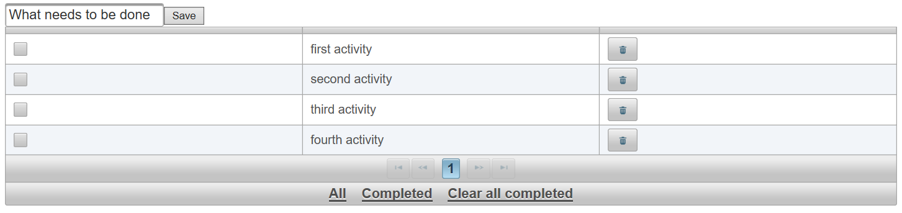
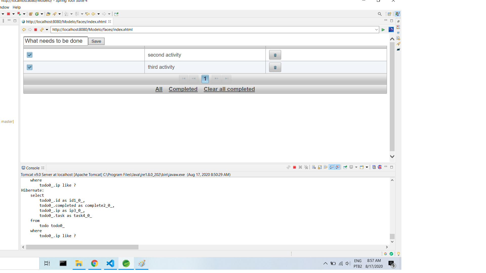
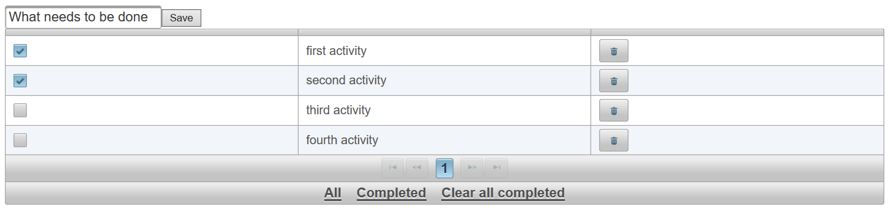

# ToDo-Java-Project
- Create, Read, Update and Delete of To Do Activities

## Technologies
- Maven Project
- Java Server Faces (JSF)
- JPA e Hibernate 
- Primefaces
- Mysql

## General Description
- This project is basicly a create, read, update and delete (CRUD) application, used for to manage tasks for a person saving 
tasks by ip of the user. The project was developed with Java Server Faces (JSF) (*A*) integrating with MySQL database (*B*) 
using Hibernate and JPA too (*C*). On frontend is used Primefaces (*G*) and your rich componentization.

## Screenshots

